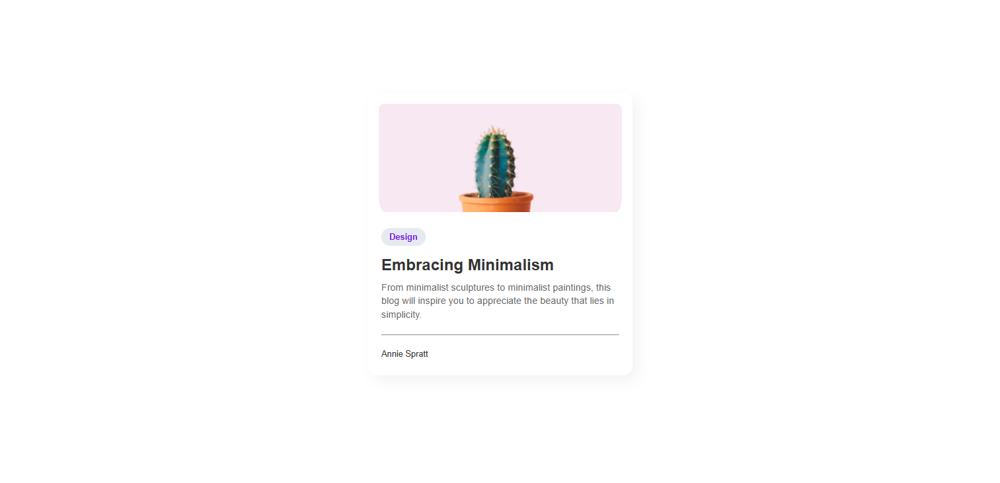

<!-- Please update value in the {}  -->

<h1 align="center">{BLOG CARD} | devChallenges</h1>

   Solution for a challenge <a href="https://devchallenges.io/challenge/minimal-blog-card" target="_blank">Minimal Blog Card</a> from <a href="http://devchallenges.io" target="_blank">devChallenges.io</a>.

  <h3>
    <a href="{https://your-demo-link.your-domain}">
      Demo
    </a>
     | 
    <a href="{https://your-url-to-the-solution}">
      Solution
    </a>
     | 
    <a href="https://devchallenges.io/challenge/minimal-blog-card">
      Challenge
    </a>
  </h3>

<!-- TABLE OF CONTENTS -->

## Table of Contents

- [Overview](#overview)
  - [What I learned](#what-i-learned)
  - [Useful resources](#useful-resources)
- [Built with](#built-with)
- [Features](#features)
- [Contact](#contact)
- [Acknowledgements](#acknowledgements)

<!-- OVERVIEW -->

## Overview

<!--
Overview
This project was a great exercise in focusing on the fundamentals: HTML structure and CSS precision. The goal was to take a static image design and translate it into a responsive, accessible blog card that looks great on any screen size.
-->

### What I learned

<!-- What I Learned
This project was a great lesson in CSS Box Model management and visual hierarchy.

Refined Box Shadows: I learned that layering shadows with low opacity (e.g., rgba(0, 0, 0, 0.05)) creates a much more professional, "minimal" look than heavy dark shadows.

Responsive Widths: Instead of a fixed width: 400px, I implemented max-width to ensure the card remains responsive on smaller mobile devices.

Object-Fit Property: I used object-fit: cover to ensure the blog image maintains its aspect ratio regardless of the container dimensions.

The Power of :hover: Adding a subtle translateY lift gives the user immediate feedback that the card is interactive. -->

### Useful resources

<!--
- Google Fonts - Inter - The typeface used to achieve the clean, modern aesthetic.

MDN Web Docs - Object Fit - A lifesaver for handling card images without distortion.
-->

### Built with

<!-- This section should list any major frameworks that you built your project using. Here are a few examples.-->

-Semantic HTML5 markup - Structured using <article> and <footer> for better accessibility.

Modern CSS Reset - Removed default browser inconsistencies for a pixel-perfect design.

Flexbox - Used on the body to perfectly center the card and within the .author-info for alignment.

CSS Transitions - Implemented smooth transform and box-shadow transitions for an interactive feel.

## Features

<!-- interactive Hover States: The card lifts and increases its shadow depth when hovered.

Responsive Scaling: Optimized for everything from small mobile screens to large desktops.

Clean Typography: Balanced line heights and font weights for maximum readability.

Semantic Structure: Fully accessible using proper HTML landmarks. -->

This application/site was created as a submission to a [DevChallenges](https://devchallenges.io/challenges-dashboard) challenge.

## Acknowledgements

<!-- Acknowledgements
Thanks to devChallenges.io for the clean design brief and resources. -->

## Author

- Website [your-website.com](https://{your-web-site-link})
- GitHub [@your-username](https://{github.com/your-usermame})

